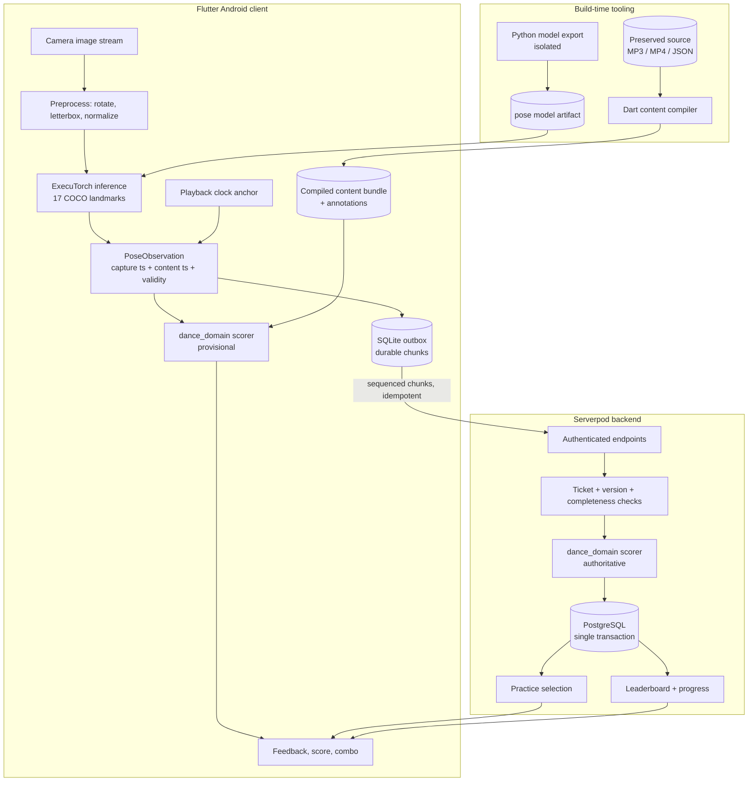
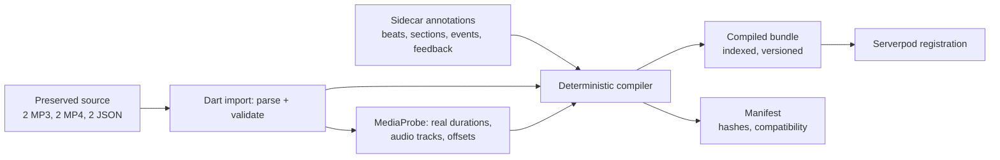

# Design — Serverpod Dance Trainer

## Overview

The system is a three-tier Dart application. A Flutter Android client captures camera frames, runs a trained pose model through ExecuTorch, and scores locally for immediate feedback. A Serverpod backend owns identity, content metadata, authoritative scoring, practice selection, progress and leaderboards. A pure Dart domain package holds the scoring and content logic and is compiled into both, which is what makes client and server scores agree.

Three design decisions carry most of the risk and therefore most of the structure:

**The domain package is pure.** `packages/dance_domain` depends on neither Flutter, nor FFI, nor Serverpod. Scoring is a function of (observations, reference bundle, scoring configuration) → result. This is what allows Requirement 8.3 — bit-identical client and server results — to be tested with fixtures rather than hoped for.

**Everything comparable is versioned and immutable.** Content versions, scoring configurations and model identities are immutable records. A leaderboard cohort is keyed by the combination. This prevents the failure where tuning the scorer silently rewrites history or merges incomparable scores.

**Time is anchored, not counted.** Dance timestamps derive from camera capture time mapped through a playback anchor into content time. No path derives a dance timestamp from a frame counter or an inference completion time. This is the difference between "you were late" and "your phone was slow".

### What changes from the original project

| Concern | Bacha Trainer | This project |
|---|---|---|
| Client | React Native + Expo, Zustand, NativeWind | Flutter, Riverpod |
| Backend | none | Serverpod + PostgreSQL |
| Inference call path | RN native module (Kotlin / Obj-C++) | Dart interface over ExecuTorch |
| Scoring location | client only | shared Dart domain, server authoritative |
| Features | 8 angle names reducing to 4 unique joint bends | 17 landmarks, derived features, annotated events |
| Reference data at runtime | 15–35 MB JSON decoded on the UI thread | compiled indexed bundle, source JSON archival |
| Content pipeline | Python developer scripts | Dart import/compile tool, Python isolated to model export |

---

## Architecture



### Repository layout

```text
serverpod_dance_trainer/
  README.md  LICENSE  THIRD_PARTY_NOTICES.md
  melos.yaml                        # or pubspec workspace, per toolchain choice
  dance_trainer_flutter/
    lib/app/                        # routing, theme, bootstrap
    lib/features/{auth,catalog,setup,gameplay,results,practice,progress,leaderboard,profile}/
    lib/infrastructure/pose/        # ExecuTorch adapter behind PoseEngine
    lib/infrastructure/media/       # player + clock anchor behind PlaybackClock
    lib/infrastructure/sync/        # outbox, retry, reconciliation
    assets/  android/  test/  integration_test/
  dance_trainer_server/
    lib/src/{endpoints,models,services}/
    config/  migrations/  test/
  dance_trainer_client/             # generated
  packages/dance_domain/
    lib/pose/  lib/scoring/  lib/content/  test/fixtures/
  tools/content_pipeline/           # Dart CLI: import, compile, verify
  content/{source,annotations,compiled,manifests,license_records}/
  scripts/
  docs/{project_plan.md,rules_serverpod_hackathon.md,architecture.md,scoring.md,device_validation.md,submission.md}
```

Generate the actual workspace with the selected Serverpod version's own scaffolding and adapt these names to what it produces. The tree describes responsibilities, not mandated filenames.

### Dependency boundaries

`dance_domain` imports nothing from the other three. `dance_trainer_server` and `dance_trainer_flutter` both import `dance_domain`. `dance_trainer_flutter` imports `dance_trainer_client`; it does not import the server. Generated transport models are mapped to domain types at the boundary — domain types never carry Serverpod annotations.

Enforce this with an analyzer or a CI check that fails on a forbidden import, the same way the original project's tiering was machine-checked rather than trusted to naming.

---

## Components and interfaces

### PoseEngine (client infrastructure)

```dart
abstract interface class PoseEngine {
  Future<ModelIdentity> load(ModelDescriptor descriptor);
  /// Returns null when the frame was dropped by backpressure.
  Future<PoseObservation?> infer(CameraFrame frame);
  Future<void> dispose();
}
```

Backpressure lives here, not in the caller: one inference in flight, at most one newest pending frame, obsolete frames dropped (Requirement 5.6). The adapter preserves `frame.captureTimestamp` into the returned observation and never synthesises one.

`ModelIdentity` carries source weights hash, input layout, dimensions, colour order, normalization, output format, delegate and exporter version. It is written into every attempt record, so a score is always attributable to a specific model.

### PlaybackClock (client infrastructure)

```dart
abstract interface class PlaybackClock {
  /// Maps a monotonic capture instant to media content time.
  Duration? contentTimeFor(Duration captureInstant);
  int get segmentId;            // increments on pause, seek, loop, rate change
  double get rate;
  void anchor(Duration contentTime, Duration atCaptureInstant);
}
```

The anchor refreshes on every player state change. A new `segmentId` invalidates pending observations — this is the mechanism behind Requirement 9.4, and it is also what stops a drill's repetition N-1 from contaminating repetition N (Requirement 12.5).

### Scorer (domain)

```dart
AttemptResult score({
  required List<PoseObservation> observations,
  required ReferenceBundle bundle,
  required ScoringConfiguration config,
  required RunConditions conditions,
});
```

Pure, synchronous, deterministic. No clock, no IO, no randomness. Identical inputs give identical `AttemptResult` on both tiers. `RunConditions` carries playback rate, pause/seek history and completion so that ranked eligibility is computed from the same evidence.

### ContentCompiler (tooling)

```dart
CompiledBundle compile({
  required SourcePoseDocument source,     // parsed original JSON, unmodified
  required AnnotationSet annotations,     // sidecar beats, sections, events
  required MediaProbe media,              // measured durations and audio tracks
});
```

Deterministic: equal source hashes, annotation hashes and compiler version produce byte-identical output. Tests reconstruct representative poses and timestamps from compiled output and compare them against the source JSON within documented tolerances.

---

## Data models

### Domain types

```dart
enum LandmarkValidity { observed, lowConfidence, absent }

class Landmark {
  final double x, y;            // normalized to restored display geometry
  final double confidence;
  final LandmarkValidity validity;
}

class PoseObservation {
  final Duration captureTimestamp;   // monotonic, from the camera
  final Duration? contentTimestamp;  // null when unmapped
  final int sequence;
  final int segmentId;
  final List<Landmark> landmarks;    // exactly 17, COCO order
  final bool personDetected;
  final String modelVersion;
}
```

A missing landmark is `LandmarkValidity.absent`, never `x: 0, y: 0`. The original project's angle-zero encoding is the exact bug this type prevents (Requirement 5.5).

The original JSON's eight angle names reduce to four unique joint bends. Preserve those angles verbatim for provenance, but derive the new feature set from the landmarks so duplicated names are not counted as independent evidence.

### Persistence (Serverpod models)

| Model | Key fields | Constraints |
|---|---|---|
| `UserProfile` | auth user ref, display name, avatar key, experience, timezone, leaderboard visibility | one per auth user; no credential fields |
| `Choreography` | stable id, title, credit, difficulty, current version, publication status | |
| `ChoreographyVersion` | routine ref, media + reference hashes, duration, bundle location, compatible scoring/model versions | immutable once published |
| `SectionDefinition` | content version, stable section id, start/end, lead-in, supported events | |
| `ScoringConfiguration` | immutable version, weights, timing windows, coverage gates, compatible models | immutable once published |
| `Attempt` | user, `clientAttemptUuid`, content/scoring/model versions, mode, ticket, status, timestamps, totals, coverage, rank eligibility + reason | unique `(user, clientAttemptUuid)` |
| `AttemptChunk` | attempt, sequence, payload hash, bounded observations, received at | unique `(attempt, sequence)`; same sequence + different hash = conflict |
| `AttemptSectionResult` | attempt, section, movement/timing scores, coverage, event counts, error summary | |
| `PracticeAssignment` | user, source attempt, section, focus error, baseline, repetitions, status, versions | |
| `DrillRepetition` | assignment, attempt, index, speed, scores, coverage, completed at | unique `(assignment, index)` |
| `UserChoreographyProgress` | user + comparable routine/version key, best eligible attempt, run/drill counts, last activity | |
| `LeaderboardEntry` | board key, user, best eligible attempt, score, achieved at | unique `(boardKey, user)` |

Finalization writes attempt result, section results, progress and leaderboard update in **one transaction** with a concurrency-safe personal-best comparison (Requirements 8, 14.5). Indexes: `(user, createdAt)` for history, `(boardKey, score DESC, achievedAt, id)` for deterministic leaderboard pagination.

### Endpoint responsibilities

| Endpoint | Operations |
|---|---|
| framework auth | register, verify, sign in, refresh, recover, sign out |
| profile | get/update own, set visibility, request deletion |
| catalog | list published, get compatible immutable manifest, get bundle location |
| attempt | begin ranked (issue ticket), create unranked, upload chunk, finalize, get finalization status, list own history |
| practice | get recommendation for owned attempt, start assignment, record/finalize repetition, complete assignment |
| progress | get own routine progress, get compatible trend series |
| leaderboard | get paginated board, get own rank |

These are responsibilities, not generated method names. Every private endpoint derives the user from the session, verifies ownership, and validates bounded input: positive durations, finite numbers, coordinate ranges, monotonic timestamps, permitted playback rate, known landmark names, payload size and immutable version references. An unknown or outdated version returns a typed error rather than an approximate score.

---

## Scoring design

### Feature normalization

Centre shape features on a stable torso reference and normalize distances by a robust body-scale estimate. Use unit limb directions and joint angles to reduce sensitivity to body proportion. Preserve ankle-relative and trajectory features separately — normalizing away lateral movement would delete the very thing a side step is scored on. Preserve image aspect ratio through preprocessing; stretching x and y independently changes joint angles and silently corrupts every downstream comparison.

Apply the session mirror transform once, consistently across preview, model output and reference.

### What is and is not observable

Score: arm raises, sideward ankle movement, knee bends, broad stance changes. Confirm the final vocabulary against recorded trials of the two routines.

Do not score, and mark unscorable where a section depends on them: partner connection, foot pressure, weight distribution, precise foot contact, toe direction, subtle 3D hip rotation. These are not recoverable from 17 2D landmarks, and claiming them would be the "nothing critical is faked" failure the judging criteria name directly.

### Event matching and scoring

For each annotated reference event, search a bounded window around its target content time for the best-matching observation. Movement quality comes from a smooth bounded error function over that event's relevant features; timing quality is full inside a configured tolerance and decays to zero at a wider cutoff. Both thresholds are per event type and live in the scoring configuration.

```
eventQuality = 0.6 × movementQuality + 0.4 × timingQuality
totalScore   = round(10000 × Σ(eventWeight × eventQuality) / Σ(allReferenceEventWeights))
```

Three rules protect the score's meaning:

- A clearly observed but unperformed movement scores zero — it is a real miss.
- An event without sufficient tracking is **unassessed**: no points, and never a match. Coverage is displayed alongside every diagnostic average.
- The denominator is the full required event set, so skipping a hard section cannot raise a score.

One observation cannot satisfy two reference events. Time warping is bounded, so lateness survives alignment.

### Error codes and feedback

Deterministic codes: `lateMovement`, `earlyMovement`, `armHeightMismatch`, `stepDirectionMismatch`, `insufficientTracking`. Priority comes from repeated high-confidence evidence. One correction at a time with a cooldown. Wording comes from templates bound to codes — no LLM in the feedback path.

### Practice selection

Rank sections by supported error severity and recurrence, gated on that section's coverage. Select an annotated musical section, preferring one or two eight-count phrases. If no reliable error exists, return a typed alternative (`recalibrateCamera`, `replayRoutine`, `optionalRefinement`) rather than a manufactured diagnosis. Deterministic for a given attempt and configuration.

---

## Content pipeline design

Source files are archival and immutable. Everything the game reads is derived, versioned and linked back to source hashes plus compiler version.



Import validates timestamps, fps, frame count, landmark names, coordinate ranges, confidence and source metadata — and must handle the two routines' **different sampling rates** (60 fps / 12,012 frames and 30 fps / 5,131 frames). Nothing may assume a shared rate.

Probe the actual MP3 and MP4 durations and audio tracks to decide, per routine, whether the video's audio or the separate MP3 is the playback master. Preserve both files; play exactly one audible track. Store measured offsets and trim mappings explicitly — matching filenames are not evidence of aligned timelines.

Annotations (beats with eight-count grouping including tempo changes, sections with stable ids and lead-ins, movement events with tolerances, feedback definitions) live in sidecar files. The source JSON is never edited. Where source tracking is unreliable, express corrections and exclusion intervals as versioned sidecars, never as an overwrite.

At approximately 178 MB of media, the distribution mechanism is a real decision: plain Git objects are unsuitable. Use Git LFS or a checksum-verified artifact fetch script, and make a fresh-checkout verification command part of the pipeline.

---

## Error handling

| Failure | Behaviour |
|---|---|
| Camera permission denied | explain consequence, offer settings route, do not enter gameplay |
| Camera stream lost mid-run | suspend judgment, mark interval unassessed, prompt repositioning |
| Model load or inference failure | stop scoring, offer recovery, emit no score, never substitute reference poses |
| No person detected | mark observation person-absent; do not take the top candidate |
| Processing backlog | drop stale frames, resume at correct content time |
| Pause / seek / backgrounding | end ranked eligibility, offer restart or unranked continuation |
| Network loss after ranked start | complete locally, queue in outbox, upload within ticket expiry |
| Ticket expired | save as unranked history, exclude from leaderboard, say why |
| Auth expired with queued items | require sign-in before sync; never re-attribute queued evidence |
| Chunk sequence conflict | reject as explicit conflict; byte-identical retry is a no-op |
| Duplicate finalization | return the existing final result |
| Incompatible content or scoring version | typed error naming the mismatch; no approximate score |
| Payload over limit | actionable error; never silent truncation |
| Concurrent personal-best writes | atomic update converging on the higher eligible score |

Generation tokens on runs and drill repetitions cause late callbacks from a disposed session to be ignored rather than applied to the current run.

---

## Testing strategy

### Domain and pipeline (fast, deterministic, no device)

- Source checksums for all six files match the preserved copies.
- Import accepts both sampling rates; frame timestamps and confidence survive round-trip.
- Compiled reference poses match representative source observations within documented tolerances.
- Compiler determinism: same source + annotations + version ⇒ byte-identical output.
- Video, separate audio, reference poses and annotated beats align at start, middle and end of each full routine.
- Geometry invariance under translation and uniform scale, with explicit tests documenting where viewpoint change breaks it.
- Mirror transform, landmark indexing and aspect-ratio restoration.
- Recorded traces for correct, early, late, wrong-direction and stationary behaviour produce distinguishable results.
- Missing-landmark, low-confidence and no-person handling.
- Timestamp mapping across pause, 0.75× playback and loop reset.
- One observation cannot satisfy two reference events.
- No reference-pose fallback; missing data never yields a perfect score.
- Client/server scoring parity on fixed fixtures with identical configuration.

### Server integration

- Cross-account rejection for profile, attempt, assignment and progress.
- Idempotent chunk upload and finalization, including a conflicting duplicate payload.
- Transactional personal-best update under concurrent finalization.
- Leaderboard exclusion of drills, slowed runs, offline-started and incomplete attempts.
- Outbox recovery after process termination and after expired authentication.

### Device and learner validation

Record consented sessions with several people of differing height, clothing and familiarity, including distance and lighting variation within the advertised setup envelope. Compare deliberate correct movement, delayed movement, wrong movement and standing still. Confirm false corrections are rare enough to be trusted, and ask learners to explain the selected correction in their own words. Have a competent bachata dancer review the event vocabulary and feedback wording.

### Full-flow acceptance

From a clean install: create account → download routine → pass setup → complete a tracked run → receive a saved result → open the recommended section → complete repetitions → see progress update → replay → view leaderboard. Restart and confirm history persists. Verify privacy and real ranking with a second account. Repeat once with network loss after gameplay begins and once with deliberately poor tracking; both must end in understandable states with no fabricated score.

---

## Decisions to resolve in the prototype

These are resolved by measurement in Phase 1–2 and then documented; they do not reopen scope.

1. Exact trained model, input resolution, licence and exporter/runtime combination. The original project contains conflicting 192- and 256-pixel input assumptions and both a test-network and a trained-YOLO exporter; the new contract must not be inferred from the old `pose.pte` filename.
2. Whether `executorch_flutter` (0.7.2, changelog reports ExecuTorch 1.4.0) is sufficient on the reference phone. Upstream ExecuTorch is 1.5.0; do not assume the wrapper's prebuilt runtime supports 1.5.0 exports. Start from the wrapper's supported runtime and its matching exporter. If it fails, time-box a minimal native adapter investigation rather than spending the schedule on an unsupported combination.
3. Actual camera timestamp access and measured media-to-camera offset on the reference device.
4. Which movements in these two routines are reliably observable from 17 landmarks.
5. Final timing windows, confidence gates and coverage thresholds, from recordings.
6. How to package ~178 MB of media independently, with verified offsets and documented permissions for development and public demonstration.
7. Whether 0.75× playback stays synchronized well enough to ship.

Prefer XNNPACK CPU inference for the first Android prototype. A newer model or delegate earns adoption only through measured accuracy and performance.
