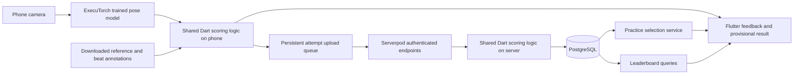

# Serverpod Dance Trainer: standalone project plan

Prepared September 19, 2026.

## 1. Product objective

Build a new Flutter and Dart dance game that helps a student learn bachata choreography through scored attempts and targeted practice. Serverpod provides authentication, user profiles, choreography metadata, saved attempts, practice recommendations, progress and leaderboards.

The defining experience is:

**Choose a choreography → dance with camera tracking → see a score and a specific correction → tap “Practice this section” → complete the drill → replay the choreography and improve.**

The project is a new implementation inspired by Bacha Trainer, preserving the existing songs, choreography videos and movement JSON. The application architecture can change completely. Content preservation is a requirement, not an optional migration shortcut. It must build and run from its own repository without the original React Native application, its dependencies, its development environment or files outside the new project's documented distribution process.

Success means the complete experience works on a real Android phone against a deployed Serverpod backend. Scoring must distinguish correct dancing, late dancing, a wrong movement and standing still. A student must understand why a practice section was selected.

This document specifies the proposed implementation. Performance thresholds and scoring constants below are initial engineering targets to validate, not measurements or claims about the existing project.

## 2. Scope and priorities

### Required release scope

- Email sign-up, verification, login, logout and account recovery using Serverpod authentication.
- A user profile containing display name, optional preset avatar, experience level, timezone and leaderboard visibility preference.
- A catalog containing both existing choreographies, “30 Minutos” and “How Deep Is Your Love,” with title, difficulty, duration, preview and availability status.
- Validate one complete routine first, then validate the second. Both existing content sets must be retained in the standalone project.
- Camera permission handling, full-body setup, mirror calibration and an eight-count lead-in.
- Real pose inference on the device, using a trained model through ExecuTorch.
- Responsive scoring, movement feedback, timing feedback and a combo indicator during full runs.
- Results containing total score, movement score, timing score, tracking coverage, personal best comparison and a recommended section.
- Server-selected practice sections with looping, normal speed and an optional slower speed if media playback supports it reliably.
- Drill completion, saved practice history and a replay action.
- Per-choreography leaderboards with consistent scoring conditions.
- Personal history and progress across comparable attempts.
- Recovery from temporary network loss without duplicate attempts or lost completed results.
- A deployed backend, an installable Android build, reproducible setup instructions and a working demonstration.

### Deferred scope

Defer instructor accounts, live multiplayer, chat, payments, user-uploaded choreography, a choreography editor, avatars with motion capture, large music catalogs and automated song beat detection. Do not add an LLM merely to phrase feedback; evidence-based templates are sufficient.

iOS is a follow-up target once the Android workflow is verified. Flutter web may later provide browsing and progress views. Browser pose inference and desktop gameplay are not required for the first release.

### Product assumptions

- One visible dancer, a fixed phone and enough space to capture the entire body.
- Initial routines emphasize visible solo movements and avoid sections dominated by occlusion or partner interaction.
- Reference clips have consistent camera framing and manually reviewed beat and movement annotations.
- Preserve the existing MP3, MP4 and movement JSON files byte-for-byte as source content. Document their sources and permissions separately for distribution and the public demo; do not silently replace or drop them during development.
- Accounts are required to save cloud progress and enter leaderboards. Signed-in users can continue downloaded practice during a temporary outage.
- Online access is required to start a ranked attempt. Offline runs remain available as unranked practice.

## 3. User experience and screen behavior

### 3.1 Welcome and account setup

Explain the app in one sentence and show “Create account” and “Log in.” Complete email verification through the configured authentication module. Ask for a display name and experience level after authentication. Use a preset avatar initially to avoid an unnecessary upload feature.

Explain camera use when the student reaches setup. Frames are processed on the phone. The app sends normalized pose measurements and timing information to save and score attempts; it does not upload camera video by default.

Leaderboard participation is opt-in. Explain that the chosen display name and score become visible. Email addresses and private profile information never appear in leaderboard responses.

### 3.2 Choreography selection

Each card shows title, difficulty, duration, thumbnail, personal best and download status. A detail screen provides a preview, the movements being practiced and a start button.

Download and validate the complete content bundle before starting. Never begin a ranked run that depends on streaming media arriving on time. Show a retry action for failed downloads and an explicit message for unsupported content or model versions.

### 3.3 Camera setup

Guide the student to place the phone on a stable surface. Show a silhouette guide and checks for shoulders, hips, knees and ankles. Require a short stable observation window before enabling the start action.

Establish whether the student should mirror the instructor. Store one explicit coordinate transform; never guess left/right independently each frame. Fix the intended screen orientation for the first release and handle camera sensor rotation correctly.

Test camera-to-audio timing on supported devices. Start a count-in only after the model, reference data, camera and media player are ready.

### 3.4 Full choreography run

Show the instructor prominently, with a smaller camera preview and optional skeleton overlay. Display score and combo in large text visible from dancing distance. Feedback should be short and infrequent enough to read while moving.

Example labels are “On beat,” “A little late,” “Raise your left arm” and “Step back into view.” Only issue a movement correction when that routine's annotated event and the observed landmarks support it.

Local scoring updates immediately. Server scoring determines the saved result after completion. Indicate “Saving result” while finalization is pending.

Interruptions must have explicit behavior:

- Camera loss: suspend judgment and prompt repositioning.
- Brief processing delay: discard stale frames and continue from the correct media timestamp.
- Pause, seek or app backgrounding: end ranked eligibility; allow a restart or continue as practice.
- Network loss after an online start: complete locally and queue upload within the ranked ticket's expiry window.
- Model failure: stop scoring and offer recovery. Never substitute instructor poses as student poses.

### 3.5 Results

Present the total score on a 0–10,000 scale, movement and timing subscores, combo, tracking coverage and personal best comparison. Clearly mark whether the result is final, awaiting upload or unranked.

Show a timeline of annotated sections and highlight the selected practice section. Explain the recommendation in plain language, for example, “Your side step started late twice in this section.” Such examples are templates, not promised outputs for every routine.

Primary action: **Practice this section**. Secondary actions: replay the choreography, view leaderboard and choose another choreography.

If tracking evidence is insufficient, recommend adjusting camera setup and retrying. Do not invent a dance correction from missing data. If all sections are strong, recommend an optional refinement section or replay and explain that no major error was found.

### 3.6 Targeted drill

Load the server's practice assignment, including content version, section boundaries, focus error, instructions and baseline evidence. Show a short preview, then lead into the section using its musical count.

Default drill: three measured repetitions at normal speed. Optional slow practice uses 0.75× playback only after audio/video synchronization is verified. Finish slow practice with a normal-speed check before comparing improvement against the original attempt.

Each loop has its own count-in and timestamp origin. Flush pending frames between loops. Prevent poses captured at the end of one repetition from affecting the next.

Drill completion means the required repetitions have enough tracking coverage to be assessed. Completion does not imply mastery. If performance remains weak, save the completed drill and offer another try without claiming improvement.

### 3.7 Drill result and replay

Show the focus metric before and after only when both observations used comparable speed, model, content and scoring versions. State the observed change, such as fewer late events, without claiming general dance proficiency.

Save repetitions and the completed assignment. Offer “Replay choreography” as the primary next action. Full-run leaderboards do not accept drill scores.

### 3.8 Progress, leaderboard and settings

Progress includes recent attempts, completed drills, best score per routine and movement/timing trends. Filter comparisons to compatible versions. Avoid a single improvement percentage that mixes difficulties or routines.

Leaderboards show the routine and difficulty, display names, ranks and scores. Highlight the student's own position and show an empty state honestly when no eligible scores exist.

Settings include mirror preference, optional skeleton overlay, audio cues, download management, profile editing, leaderboard visibility, logout and account deletion. Implement deletion through a documented server workflow that removes personal results and leaderboard records.

## 4. Standalone technical architecture

The application, backend and scoring domain are written in Dart. ExecuTorch remains a native inference runtime called through a Dart interface. Python is permitted as an isolated, reproducible model-export and content-preparation tool; no Python runtime is required on the student's phone or for the core Serverpod request path.



### Proposed repository structure

```text
serverpod_dance_trainer/
  README.md
  LICENSE
  THIRD_PARTY_NOTICES.md
  pubspec.yaml
  pubspec.lock
  dance_trainer_flutter/
    lib/app/
    lib/features/auth/
    lib/features/catalog/
    lib/features/setup/
    lib/features/gameplay/
    lib/features/results/
    lib/features/practice/
    lib/features/progress/
    lib/features/leaderboard/
    lib/features/profile/
    lib/infrastructure/pose/
    lib/infrastructure/media/
    lib/infrastructure/sync/
    assets/
    android/
    test/
    integration_test/
  dance_trainer_server/
    lib/src/endpoints/
    lib/src/models/
    lib/src/services/
    config/
    migrations/
    test/
  dance_trainer_client/
    lib/
  packages/dance_domain/
    lib/pose/
    lib/scoring/
    lib/content/
    test/fixtures/
  tools/content_pipeline/
  content/source/30minutos/
  content/source/howdeepisyourlove/
  content/annotations/
  content/compiled/
  content/manifests/
  content/license_records/
  scripts/
  docs/architecture.md
  docs/scoring.md
  docs/device_validation.md
  docs/submission.md
```

Use the layout generated by the selected Serverpod version as the starting point. The tree describes responsibilities; adapt file names to the actual generator. Keep domain types independent of Flutter, FFI and Serverpod. Map generated transport models to domain types at the application boundaries.

### Dependency and version policy

As checked on September 19, 2026:

- Serverpod documentation describes version 4.0.0. Select and lock a compatible released Serverpod toolchain, authentication modules and generated client together. [Serverpod architecture](https://docs.serverpod.dev/how-it-works)
- Upstream ExecuTorch is 1.5.0. [Release](https://github.com/pytorch/executorch/releases/tag/v1.5.0)
- The community `executorch_flutter` package is 0.7.2; its changelog records an upgrade to ExecuTorch 1.4.0. Do not assume its prebuilt native runtime supports 1.5.0 exports. Verify and record the resolved runtime. [Package](https://pub.dev/packages/executorch_flutter), [changelog](https://pub.dev/packages/executorch_flutter/changelog)
- Start with the wrapper's supported runtime and matching exporter. Evaluate a 1.5.0 native build only if it solves a measured problem and passes the same device checks.
- Select a stable Flutter/Dart combination compatible with Serverpod and the wrapper. Commit application lockfiles and document exact versions, model export dependencies and target device requirements.
- Use one state-management approach for Flutter. Riverpod is the proposed default, with gameplay state transitions kept in a testable controller.
- Wrap camera, media playback, inference and local persistence behind interfaces so package-specific behavior does not leak into scoring.
- Use an explicit local SQLite outbox for reliable result uploads. Do not make the first release depend on experimental automatic database synchronization.

## 5. Pose inference and content pipeline

### 5.1 Landmark contract

Retain all 17 COCO landmarks, each with x, y and confidence. The existing project's eight angle names reduce to four unique joint bends; the new system must not repeat that reduction.

Define `PoseObservation` with capture timestamp, content timestamp, sequence number, landmark array, person-detection status and model version. Use a dedicated validity value for missing landmarks rather than encoding missing measurements as angle zero.

A trained pose model supplies landmarks. ExecuTorch executes it. Dart computes movement features, timing and game feedback. Upgrading the runtime alone does not improve model training or create dance-specific understanding.

### 5.2 Model verification

1. Select a trained pose model with usable licensing and an export path compatible with the chosen runtime.
2. Record source weights, checksum, expected input layout, dimensions, color order, normalization, output format and supported delegates.
3. Export a known checkpoint and compare reference PyTorch output with ExecuTorch output on representative recorded frames.
4. Verify no-person handling. A model wrapper that always selects the highest-scoring candidate must also reject low person confidence.
5. Validate left/right ordering, aspect ratio, camera rotation and coordinate restoration after resize or letterboxing.
6. Run the model through Flutter on a physical phone and record sustained inference rate, latency, memory and tracking quality.

The old project has multiple export paths, including a test-network exporter and a trained YOLO exporter. It also contains conflicting 192- and 256-pixel input assumptions. Do not infer the new model contract from an old filename such as `pose.pte`.

Prefer XNNPACK CPU inference for the first Android prototype. Evaluate acceleration only after a correctness baseline exists. A newer model or delegate must earn adoption through measured accuracy and performance.

### 5.3 Camera processing

Use a camera image stream rather than repeated JPEG photographs encoded as base64. Keep image conversion and inference off the UI thread using the selected packages' supported background execution mechanism.

Allow one inference in flight with at most one newest pending frame. Drop obsolete frames rather than building an inference queue. Preserve acquisition timestamps through preprocessing and inference. Rendering may run faster than inference.

Handle dropped frames, duplicated timestamps and out-of-order callbacks explicitly. Smoothing may reduce jitter but adds delay; include that delay in timing validation and avoid long filters that hide real movement changes.

### 5.4 Choreography bundle

Use a content adapter and compiler between the preserved source files and the new scoring system. This lets us change the architecture and runtime data format while retaining the existing movement mappings and media.

#### Existing content inventory

The following files were verified in the current workspace on September 19, 2026:

| Routine ID | Audio source | Video source | Movement source | JSON timing |
|---|---|---|---|---|
| `30minutos` | `mobile/assets/audio/30minutos.mp3` | `mobile/assets/videos/30minutos.mp4` | `mobile/assets/poses/30minutos.json` | 12,012 frames at 60 FPS; final timestamp about 200.18 seconds |
| `howdeepisyourlove` | `mobile/assets/audio/howdeepisyourlove.mp3` | `mobile/assets/videos/howdeepisyourlove.mp4` | `mobile/assets/poses/howdeepisyourlove.json` | 5,131 frames at 30 FPS; final timestamp 171 seconds |

These paths are migration inputs only. Copy the files into the new repository's managed content area or its independently managed asset distribution, then remove all build-time reliance on the old paths.

The JSON files contain `songId`, `fps`, `totalFrames`, model metadata and per-frame `frameNumber`, `timestamp`, `keypoints` and `angles`. Each frame has mappings for 17 landmarks, with coordinates and confidence. They are explicit pose trajectories and angle mappings, rather than learned embedding vectors. No new embedding model is required to reuse them.

The two JSON files are about 35 MB and 15 MB respectively. Their original bytes should remain the archival source, but repeatedly loading and decoding the full JSON on the UI thread is unsuitable for gameplay.

#### Content migration and compilation

1. Inventory and checksum all six active source files: two MP3s, two MP4s and two JSON files. Keep stable routine IDs. Historical pose backups are optional archives and must not become playable routines automatically.
2. Copy source files into the independent content store and verify hashes against the originals. Include them through repository assets, Git LFS or a documented independent artifact download, with a fresh-checkout verification command.
3. Write a Dart import tool that parses the existing schema without requiring React Native or Python. Validate timestamps, FPS, frame count, landmark names, coordinate ranges, confidence and source metadata. Do not assume the two files have the same sampling rate.
4. Preserve original angles and model metadata for provenance. Derive the new unique features from the original landmarks; do not treat duplicate angle names as independent evidence or treat metadata accuracy claims as measured app quality.
5. Probe actual MP3/MP4 durations and audio tracks. Determine whether video audio or the separate MP3 is the playback master for each routine. Preserve both source files, but play only one audible track. Store verified offsets and trim mappings explicitly; do not assume matching filenames mean aligned timelines.
6. Produce a versioned, compact runtime bundle with indexed section access. Preserve source timestamps and link every derived bundle to source hashes and compiler version. Choose compression and any resampling only after comparing event timing and scoring against the full source.
7. Add beat markers, musical sections, movement events and feedback definitions in separate sidecar annotation files. Existing pose JSON stays unchanged.
8. Review source tracking quality. Represent invalid intervals and corrected annotations in versioned sidecars or derived files. If a newer inference model disagrees systematically with the reference convention, evaluate compatibility and derive a separately versioned reference from the retained video only where needed. Never overwrite the preserved source.
9. Register both routine manifests with Serverpod, fetch their compiled bundles from Flutter and test each routine end to end.

The content compiler should be deterministic. Equal source hashes, annotation hashes and compiler version should generate identical output. Keep tests that reconstruct representative poses and timestamps from compiled output and compare them against source JSON.

#### Runtime bundle contract

Each immutable content version includes:

| Item | Required information |
|---|---|
| Manifest | Routine ID, version, title, difficulty, duration, checksums and compatibility requirements |
| Media | Licensed video and synchronized audio, thumbnail and preview |
| Reference poses | Timestamps, original landmark confidence and normalized features |
| Beat map | Explicit beat timestamps and eight-count grouping, including tempo changes |
| Sections | Stable IDs, media start/end boundaries and lead-in boundaries |
| Movement events | Target time, event type, required landmarks, reference trajectory and scoring tolerances |
| Feedback definitions | Supported error codes, clear wording and correction instructions |
| Provenance | Media permissions, model license, export settings and annotation reviewer |

Retain both existing songs and videos as the default catalog content. Validate and package all assets inside the new project's distribution process. A fresh checkout must not rely on the original repository's local videos. Keep source-content preservation and any separate public-distribution permissions explicit in the release documentation.

Review reference poses and event annotations manually. Use versioned corrections and exclusion intervals before judging students against unreliable reference observations. New scoring features and annotations extend the preserved movement data; regenerating the entire reference dataset is not the default plan.

Make both complete content sets available to the standalone application through bundled assets or documented, checksum-verified downloads. One routine may be bundled for immediate first use while the second downloads on selection. For larger assets use a controlled artifact store with a reproducible fetch script; commit manifests and permissions. Never depend on an undocumented developer download directory.

## 6. Movement, timing and confidence scoring

### 6.1 Observable movements

Start with a small event vocabulary: arm raises, sideward ankle movement, knee bends and broad stance changes. Confirm the final vocabulary with recorded trials of the selected routines.

Do not claim to measure partner connection, pressure through a foot, weight distribution, precise foot contact, toe direction or subtle 3D hip rotation from these 2D landmarks. Omit or mark unscorable sections that require those observations.

### 6.2 Normalization

- Center shape features around a stable torso reference and normalize distances by a robust body-scale estimate.
- Use unit limb directions and joint angles to reduce body-proportion sensitivity.
- Preserve separate ankle-relative and trajectory features needed to recognize steps. Do not normalize away the movement being scored.
- Apply an explicit mirror transform and keep the convention consistent across preview, model output and reference data.
- Preserve image geometry during preprocessing; independently stretching x and y changes joint angles.
- Require roughly comparable camera orientation. Scale normalization cannot reconstruct an arbitrary 3D viewpoint from a 2D skeleton.

### 6.3 Time alignment

Map monotonic camera capture time to media content time using an anchored playback clock. Refresh the anchor on player state changes. Do not use processed-frame count or inference completion time as the dance timestamp.

Store beat markers in content time. Slow practice maps wall-clock time through the actual playback rate. Pauses, seeks, loop boundaries and playback discontinuities start a new time segment and flush pending observations.

Recognize each movement event in a bounded window around its expected time. Use the matched observation for movement quality, but retain its signed time offset for timing quality. Unlimited time warping must not erase late or early execution. One student event cannot satisfy multiple reference events.

Report “early” or “late” only when confidence and timing resolution support the judgment. Devices producing sparse observations need wider tolerances or an unranked mode, not fabricated millisecond precision.

### 6.4 Initial score definition

The proposed total is 0–10,000. Each annotated event has a fixed reference weight. An event's assessed quality combines 60% movement and 40% timing. These weights are initial defaults to tune against recordings, then freeze in a scoring version.

Movement similarity uses a smooth bounded error function across the event's relevant features. Timing similarity is full within a configured tolerance and decreases toward zero at a wider cutoff. Keep both thresholds in the scoring configuration by event type.

For an assessable event:

`eventQuality = 0.6 * movementQuality + 0.4 * timingQuality`

`totalScore = round(10000 * sum(eventWeight * eventQuality) / sum(allReferenceEventWeights))`

For a clearly observed but missed movement, event quality is zero. Missing tracking is labeled unassessed and awards no points; it must not become a successful match. The denominator includes the routine's full required event set so hiding difficult sections cannot increase a score.

Movement and timing diagnostic averages may use assessed events only, but must always display coverage alongside them. If coverage is too low, suppress the overall performance judgment and mark the run unranked. Report what was observed without blaming the student for camera failure.

Example initial ranking gate: at least 85% weighted event coverage, no long unobserved required section, completed playback, normal speed and a supported scoring/model/content combination. Tune the exact coverage and gap thresholds on real device recordings before freezing them.

### 6.5 Combos and feedback

Award combos for consecutive sufficiently accurate, on-time events. Do not use a combo multiplier in the initial leaderboard score; it would obscure whether score improvements reflect movement or a tuning choice.

Use deterministic error codes such as `lateMovement`, `earlyMovement`, `armHeightMismatch`, `stepDirectionMismatch` and `insufficientTracking`. Determine priority from repeated high-confidence evidence. Choose one actionable correction at a time, with a cooldown to avoid flickering advice.

### 6.6 Practice recommendation

Serverpod recomputes section summaries from submitted measurements using the shared scorer. Rank sections by supported error severity and recurrence, subject to sufficient tracking coverage. Select an existing musical section rather than arbitrary video boundaries.

The assignment includes source attempt, section, focus error, baseline metric, required repetitions and score/content versions. Prefer a short, understandable section, typically one or two eight-count phrases.

If no reliable error exists, return a typed alternative: camera recalibration, whole-routine replay or optional refinement. Never manufacture a diagnosis to keep the button populated.

## 7. Serverpod responsibilities and data model

Use Serverpod endpoints and generated clients, PostgreSQL persistence and framework authentication. Personalization and final scoring are server behavior, not a static catalog with an unrelated score upload. [Serverpod documentation](https://docs.serverpod.dev/how-it-works)

### Proposed persistent models

| Model | Main fields and relationships |
|---|---|
| UserProfile | Auth user reference, display name, avatar key, experience, timezone, visibility, created/updated timestamps |
| Choreography | Stable ID, title, artist/credit, difficulty, current version, publication status |
| ChoreographyVersion | Routine reference, media/reference hashes, duration, bundle location, compatible scoring/model versions |
| SectionDefinition | Content version, stable section ID, start/end time, lead-in and supported event annotations |
| ScoringConfiguration | Immutable version, feature weights, timing windows, coverage gates and compatible model definitions |
| Attempt | User, client UUID, content/scoring/model versions, mode, ticket, status, timestamps, totals, coverage, rank eligibility and reason |
| AttemptChunk | Attempt, sequence, payload hash, bounded pose/timing observations and received timestamp |
| AttemptSectionResult | Attempt, section, movement/timing scores, coverage, event counts and evidence-backed error summary |
| PracticeAssignment | User, source attempt, section, focus, baseline, repetitions, status and version references |
| DrillRepetition | Assignment, attempt, repetition index, speed, scores, coverage and completion timestamp |
| UserChoreographyProgress | User plus comparable routine/version key, best eligible attempt, completed runs/drills and latest activity |
| LeaderboardEntry | Board key plus user, best eligible attempt, score and achievement timestamp |

Authentication credentials belong to the framework's authentication records. Do not duplicate password storage in `UserProfile`.

### Constraints and consistency

- Unique `(user, clientAttemptUuid)` prevents duplicate attempts.
- Unique `(attempt, chunkSequence)` prevents duplicate evidence uploads. Reusing a sequence with different bytes is an explicit conflict.
- Unique `(boardKey, user)` stores one personal best per leaderboard.
- Unique `(assignment, repetitionIndex)` prevents duplicate drill completions.
- Foreign keys protect content/version relationships. Released content and scoring versions are immutable.
- Derive the authenticated user on the server. Never accept client-provided ownership as authority.
- Finalization writes the attempt result, section results, progress and leaderboard update in one transaction, with concurrency-safe personal-best updates.
- Store timestamps in UTC. Apply profile timezone only for display and any later daily activity features.
- Use paginated history and leaderboard queries with indexes on user/time and board/score.

### Endpoint contracts

These are proposed API responsibilities, not claims about generated Serverpod method names.

| Endpoint | Operations |
|---|---|
| Framework authentication | Register, verify, sign in, refresh credentials, recover account and sign out |
| Profile | Get/update own profile, change visibility and request deletion |
| Catalog | List published routines, retrieve compatible immutable manifests and content download locations |
| Attempt | Begin ranked run, create unranked upload, upload evidence chunk, finalize, retrieve finalization status and list own history |
| Practice | Retrieve recommendation for an owned attempt, start assignment, record/finalize repetitions and complete assignment |
| Progress | Retrieve own routine progress and compatible trend series |
| Leaderboard | Retrieve paginated board and current user's rank |

Every private endpoint verifies ownership and bounded input. Validate positive durations, finite numbers, coordinate ranges, monotonic timestamps, permitted speed, known landmarks, payload sizes and immutable version references. Unknown or outdated versions produce a useful error rather than an approximate score.

## 8. Reliable uploads and leaderboard integrity

### Ranked attempt lifecycle

1. The authenticated client requests a run ticket for a specific content/scoring version.
2. Serverpod records server start time and returns an opaque ticket with an expiry appropriate to the routine duration plus a documented upload grace period.
3. The phone performs local inference and appends compact observations to durable local storage.
4. The client sends sequence-numbered chunks. Retries are idempotent.
5. The client requests finalization with the expected sequence count and final content timestamp.
6. The server checks completeness, run conditions, versions and coverage, then recomputes scores and selects a recommendation.
7. Finalization commits once. A retry returns the existing final result.
8. The phone reconciles provisional and final scores and marks the local outbox item delivered.

For the first bounded release, support at least four-minute routines so the existing approximately 200-second “30 Minutos” reference fits without truncation. Verify actual media durations during import and increase the bound if necessary to preserve full routines. Start with evidence sampling around 10–15 observations per second, preserving event timing adequately in device tests. Set explicit serialized payload limits, such as chunks below 256 KiB and a total attempt budget around 6 MiB, after measuring the real encoding. If payloads exceed limits, stop with an actionable error; never truncate invisibly.

Evidence contains normalized landmarks, confidence, timestamps and run-state changes. Camera pixels stay local. Treat pose traces as private user data: retain only as long as needed for recomputation/debugging, then keep aggregate results under a documented retention policy.

### Connectivity and authentication recovery

Persist the outbox by account. Retry with bounded exponential backoff and resume from the last acknowledged chunk. After an application restart, recover completed pending attempts. If authentication expires, request login before sync and never attach one account's queued data to another account.

Already downloaded practice can run offline. Show locally saved results as pending and provide a local provisional recommendation using the same selection rules. Label it pending sync. The server confirms or replaces it after upload.

Ranked tickets that expire before valid upload cannot enter the leaderboard, but the attempt may still be saved as unranked history. Incomplete runs remain incomplete and never create a personal best.

### Leaderboard rules

Board key: choreography content version, difficulty, scoring version and compatible model/scoring cohort. Only combine different inference models when validation demonstrates comparable scoring and an explicit compatibility group permits it.

Accept normal-speed, completed, sufficiently observed ranked attempts. Paused, slowed, sought, offline-started or interrupted runs do not qualify. Drill scores are excluded.

Order by total score descending. Equal scores share a displayed rank; use achievement timestamp and a stable ID for deterministic pagination. Update a user's best atomically when simultaneous finalizations arrive.

Server recomputation prevents simply submitting an arbitrary total. It does not prove that client pose traces are authentic. Apply request limits and basic plausibility checks, but describe the first leaderboard as a casual game leaderboard, not a cheating-proof competition system.

## 9. State machines and error recovery

Keep gameplay state separate from cloud synchronization state.

Gameplay states:

`selecting → downloading → settingUp → countingIn → running → finishing → results → preparingDrill → drilling → drillResults`

Relevant side states are `pausedPractice`, `trackingLost`, `recoverableError` and `aborted`. Transitions must define camera, media, inference and timer ownership. Leaving a session disposes each resource once.

Upload states:

`local → queued → uploading → awaitingFinalization → synced`

Failures distinguish retryable network errors, authentication required, incompatible content and permanently rejected ranked eligibility. Do not trap the student on a spinner when a result is available locally.

Give each run and drill repetition a generation token. Ignore callbacks from older generations after restart or disposal. This avoids late inference results changing a new run's score.

## 10. Performance and reliability targets

Measure release builds on the chosen reference Android phone and one lower-performance phone where available.

| Area | Initial target and validation |
|---|---|
| Pose processing | Sustained 15 Hz target; record actual distribution and degrade visibly if event timing becomes unreliable |
| Feedback delay | Aim for p95 capture-to-feedback below 200 ms; timing calculations still use capture timestamps |
| Display | Smooth playback and readable score updates without inference blocking the UI |
| Session stability | Ten minutes of repeated runs without crash, unbounded memory growth or a growing frame queue |
| Score repeatability | Same recorded trace and version produce the same result on Dart client and server |
| Timing | Known offsets in recorded traces are recovered within an agreed tolerance based on capture rate |
| Upload recovery | App restart and dropped responses do not lose or duplicate completed attempts |
| Backend | Finalization and leaderboard updates remain bounded at expected demo concurrency; record actual latency |

Do not inherit the old README's performance claims. Record device model, OS, app build, model hash, delegate, measured frame rate and thermal conditions with each result.

## 11. Verification strategy

### Meaningful automated checks

- Original MP3, MP4 and JSON checksums match the independently preserved source copies for both routines.
- The content adapter accepts both existing JSON sampling rates and preserves frame timestamps and landmark confidence.
- Compiled reference poses match representative source observations within documented numeric tolerances.
- Video, separate audio, reference poses and annotated beats align at the beginning, middle and end of each full routine.
- Geometry invariance for translation and uniform scale, with explicit tests showing the limits of viewpoint changes.
- Mirror transformation, landmark indexing and aspect-ratio restoration.
- Recorded event traces for correct, early, late, wrong-direction and stationary behavior.
- Missing-landmark handling, low-confidence periods and no-person frames.
- Timestamp mapping across pauses, slow playback and loop resets.
- One observed event cannot satisfy multiple reference events.
- No reference-pose fallback and no perfect-score behavior on missing data.
- Client/server scoring parity using fixed fixtures and the exact same configuration.
- Cross-account access rejection for profiles, attempts, assignments and progress.
- Idempotent chunk upload and finalization, including conflicting duplicate payloads.
- Transactional personal-best updates under concurrent finalization.
- Exclusion of drills, slowed runs and incomplete attempts from leaderboards.
- Persistent outbox recovery after process termination and expired authentication.

### Device and learner validation

Record consented test sessions for at least several people with different heights, clothing and familiarity with the routine. Include changes in distance and lighting within the advertised setup requirements.

Compare deliberate correct movement, delayed movement, wrong movement and standing still. Confirm false corrections are rare enough that students trust the feedback. Ask learners to explain the selected correction in their own words.

Have learners complete a recommended drill and replay. Report observed improvements and failures honestly; do not assume every drill improves the next run. Review at least the initial event vocabulary and feedback with a competent bachata dancer.

### Complete-flow acceptance scenario

From a clean install, create an account, download a routine, pass camera setup, finish a real tracked run, receive a saved result, open the selected practice section, complete the repetitions, see progress update, replay and view the leaderboard. Restart the app and confirm the same history remains. Use a second account to verify privacy and genuine leaderboard behavior.

Repeat once with network loss after gameplay begins and once with deliberately poor tracking. Both must end in understandable states without fabricated scores.

## 12. Sequenced implementation plan

Dates are a proposed schedule for the October 14, 2026 deadline. Move effort between phases as evidence requires, but protect the final validation period. Checkpoints are technical exit criteria, not recurring permission requests.

| Phase | Target dates | Deliverables | Exit criterion |
|---|---|---|---|
| 0. Standalone foundation | Sep 19–20 | New repository, preserved content inventory, Flutter/Serverpod workspace, domain package, version manifest, CI and local database setup | Fresh checkout verifies both source content sets, starts Flutter and calls a real Serverpod endpoint |
| 1. Pose and clock prototype | Sep 20–22 | Trained exported model, Flutter camera stream, landmark overlay, preprocessing and capture/media clock mapping | Physical phone distinguishes basic movements and yields trustworthy timestamps; no mock inference |
| 2. Content and scoring | Sep 23–26 | Adapter for both existing JSON files, first compiled bundle, reviewed beats/events, recorded fixtures and shared Dart scorer | Source data is preserved and correct/late/wrong/stationary traces produce sensible, reproducible differences |
| 3. Accounts and first full run | Sep 27–30 | Auth, profile, catalog, setup, gameplay, durable outbox and saved final result | Real authenticated student completes a routine and retrieves the saved result after restart |
| 4. Practice loop | Oct 1–4 | Section aggregation, server recommendation, drill looping, completion and progress | Result → practice section → measured drill → replay works end to end |
| 5. Leaderboard and second routine | Oct 5–7 | Ranking constraints, personal bests, history and validation of the second preserved routine | Both original routines are playable; two users create valid rankings; practice and invalid runs are excluded |
| 6. Device and learner hardening | Oct 8–11 | Learner trials, latency measurements, recovery fixes, scoring freeze and UI refinement | Acceptance scenarios pass on real devices and feedback is understandable |
| 7. Submission build | Oct 12–14 | Deployed server, release APK, final runbook, short demo and submission text | Fresh-install test passes against deployed backend; required materials ready before 23:59 CEST Oct 14 |

### Phase task details

**Phase 0**

- Create an independently initialized repository named `serverpod_dance_trainer` and generate the standard Serverpod project.
- Add the pure Dart domain package and dependency boundaries.
- Set up formatting, analysis, unit tests and server integration tests in CI.
- Add environment templates with no committed secrets, seed data and a documented development account flow.
- Inventory and preserve both existing MP3/MP4/JSON content sets with checksums, write a standalone asset manifest and decide the reference Android device.

**Phase 1**

- Verify model license, trained weights and runtime/export compatibility.
- Compare exported outputs against reference inference on selected images.
- Prove real Flutter inference, no-person behavior and sustained processing.
- Implement capture timestamps, preview transformations and media clock anchoring.
- If the community wrapper fails, time-box a minimal native adapter investigation. Do not spend the remaining project schedule on an unsupported model/runtime combination.

**Phase 2**

- Implement the Dart content adapter for both original JSON files, compile the first routine and add beat markers, sections and assessable events as sidecars.
- Implement confidence gates, geometry features, bounded event matching and versioned scoring.
- Create fixtures from correct and intentionally incorrect performance.
- Implement evidence-based feedback templates and section summaries.

**Phase 3**

- Configure real email delivery and framework auth flows for the deployed environment.
- Implement profile, catalog and local content caching.
- Complete gameplay state handling and results UI.
- Implement attempt tickets, evidence uploads, server finalization and outbox recovery.

**Phase 4**

- Implement deterministic recommendation ranking and fallback reasons.
- Build section previews, count-in, repetition lifecycle and comparable drill results.
- Save assignment completion and update progress exactly once.
- Validate normal-speed looping before adding slow playback.

**Phase 5**

- Implement board partitioning, visibility preferences, pagination and current-user position.
- Test concurrent personal-best updates and eligibility exclusions.
- Compile and validate the second preserved routine through the same content pipeline, including full-length audio/video/pose alignment.

**Phases 6–7**

- Resolve failures observed on phones and with learners before adding features.
- Freeze content, scoring and model versions for comparable final results.
- Deploy and validate authentication, database migrations, assets and HTTPS API configuration.
- Test setup from a clean checkout and installation from the actual release build.
- Record the demonstration using real tracking, real server writes and real leaderboard entries.

### Scope reduction order if work slips

Cut cosmetic animation, slow playback, extended trend charts and optional avatar customization first. Reduce the number of distinct correction types and annotated practice sections before cutting core behavior. Keep both existing full source routines, authentication, real tracking, saved results, a complete targeted drill and leaderboard behavior intact. Do not silently drop a song or shorten a full routine to meet a deadline. If either routine remains unvalidated, mark that requirement incomplete and report the specific issue.

## 13. Deployment, operations and reproducibility

Use Serverpod Cloud as the proposed production destination, with a documented local PostgreSQL development path. The final hosting choice must support the locked Serverpod version, database migrations, secrets and email delivery. [Serverpod Cloud](https://docs.serverpod.dev/cloud)

Maintain separate development and production configuration. Do not put credentials in the app bundle, repository, example config or logs. Use framework token storage on the client and avoid logging tokens or pose payloads.

The README must include:

- Exact Flutter, Dart, Serverpod and model export versions.
- Local service startup, migration, seed and generated-client instructions.
- How a physical phone reaches the local backend.
- How to fetch verified model/media assets from a clean checkout.
- Android build and installation instructions, device requirements and known limitations.
- Email authentication configuration and a usable judging account procedure.
- Test commands and location of device-validation evidence.
- Production deployment, health checking, migration and rollback instructions.

Use structured server logs for attempt ID, error category, duration and finalization outcome. Monitor failed uploads, incompatible versions and finalization errors. Keep an installable release and its matching source revision together.

Retain previous model/content/scoring artifacts needed to serve submitted attempts. Deploying a new scorer must not silently change stored historical results or merge incompatible leaderboard cohorts.

## 14. Hackathon delivery requirements

The local official-rules transcription lists a submission deadline of October 14, 2026 at 23:59 CEST. It requires a working full-stack Serverpod application, source/build instructions, an English description and a public demonstration video under two minutes. The build must remain accessible for judging through October 20 at 17:00 CEST.

Prepare the repository, an installable Android build and working backend access. Keep test credentials in the appropriate private judging instructions, not public source. Disclose AI coding tools, model components and integrations in the submission description.

Use permitted music, video and visual assets in the demo. Do not use Just Dance branding; its score-feedback style is an interaction reference only.

Suggested 110-second demonstration:

| Time | Evidence shown |
|---|---|
| 0–15 seconds | Student problem, signed-in account and choreography selection |
| 15–45 seconds | Real camera tracking, visible dancing and responsive scoring |
| 45–65 seconds | Saved result and a specific evidence-backed correction |
| 65–90 seconds | Tap “Practice this section” and demonstrate a measured repetition |
| 90–110 seconds | Completed drill, saved progress and real leaderboard state |

Edit for time without suggesting an unobserved improvement or a fake continuous run. Show the actual target device and make the Serverpod-backed state changes visible.

Judging weights are functionality 30%, Serverpod use 25%, craft/technical creativity 25% and usefulness 20%. Functionality is the first tie-break. Allocate effort accordingly.

Rules source: [local transcription](./rules_serverpod_hackathon.md). Copy the relevant event requirements into the new project's submission documentation so the new repository remains independent. The linked official PDF was unavailable during preparation of this plan; the local transcription is the basis for the event details above.

## 15. Definition of done

- [ ] The new repository has no runtime or build dependency on the original project.
- [ ] Both original MP3, MP4 and JSON content sets are preserved with verified checksums and available through the independent distribution process.
- [ ] The Dart content adapter and compiled bundles preserve both routines' landmark mappings, confidence and timelines; new annotations are separate from source JSON.
- [ ] A fresh checkout can obtain all required assets, start the backend and build the Android application using documented steps.
- [ ] Authentication, account recovery, profile editing and leaderboard visibility work against the deployed server.
- [ ] The catalog contains the agreed validated routines and each can be selected and downloaded.
- [ ] A trained model produces real landmarks on the target phone; no student-pose mock or reference fallback exists in production gameplay.
- [ ] Capture/media synchronization, mirror convention and confidence handling are verified.
- [ ] Correct, late, wrong and stationary performances produce distinguishable, defensible results.
- [ ] A completed run produces a server-saved score and an understandable recommendation.
- [ ] “Practice this section” starts the assigned section, measures repetitions and saves completion.
- [ ] Drill results compare only compatible observations and do not imply mastery without evidence.
- [ ] A replay updates progress and any eligible personal best.
- [ ] Leaderboards are partitioned consistently and exclude drills and invalid ranked conditions.
- [ ] Network retries, app restart, expired authentication and duplicate finalization preserve data integrity.
- [ ] User data is private by default, camera video stays local and server evidence retention is documented.
- [ ] Device measurements and learner feedback support the advertised capabilities.
- [ ] Release build, backend, source, instructions and demonstration are available for judging.

## 16. Implementation decisions to resolve through the first prototype

These decisions should be resolved by testing and documented without reopening the agreed product scope:

1. Exact trained model, input resolution, license and exporter/runtime combination.
2. Whether the community Flutter wrapper is sufficient on the reference phone.
3. Actual camera timestamp access and measured media-to-camera offset.
4. Which movements in the chosen routines are reliably observable with the 17-landmark model.
5. Final timing windows, confidence gates and coverage requirements based on recordings.
6. How to package both preserved media sets independently, verify their timing offsets and document permissions for distribution and the public demo.
7. Whether slow playback remains synchronized enough to include in the first release.

The first milestone is a real phone demonstrating trustworthy landmarks and event timing. The final milestone is a student completing the entire dance, result, drill and replay loop with persistent Serverpod progress and a valid leaderboard entry.
